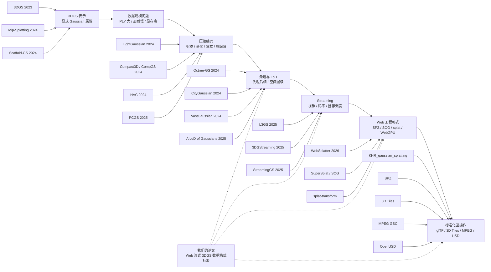

# 3DGS 数据格式相关文献发展脉络图谱

这份笔记基于 Friday 的第二轮整理，目标不是继续罗列文献，而是回答一个更重要的问题：

```text
这些文献为什么会按现在这个方向发展？
```

核心判断：

```text
3DGS 的发展不是从一个“格式问题”开始的。
它先解决实时新视角渲染，然后因为显式 Gaussian 资产太大，逐步引出压缩、LoD、Streaming、Web 工程格式和标准化互操作。
```

## 1. 总体脉络

可以把 3DGS 数据格式相关研究理解成一条工程压力链：

```text
3DGS 表示
  -> 数据规模问题
  -> 压缩编码
  -> 渐进 / LoD / Streaming
  -> Web 工程格式
  -> 标准化 / 互操作
```

其中每一步都不是孤立出现的，而是上一阶段把一个问题解决后，又暴露出了新的瓶颈。

## 2. 可编辑 Mermaid 图谱

下面这张图是可编辑的 Mermaid 源码。后续想改节点、改箭头、增删文献，只需要直接修改代码块即可。



## 3. 第一阶段：3DGS 表示

代表文献：

- 3D Gaussian Splatting for Real-Time Radiance Field Rendering, 2023
- Mip-Splatting, 2024
- Scaffold-GS, 2024

这一阶段的关键变化是：场景不再只是一个需要反复查询的神经网络，而变成了一组可以被 GPU 光栅化的显式 Gaussian primitives。

每个 Gaussian 携带位置、尺度、旋转、不透明度、球谐颜色等属性。于是问题发生了转移：

```text
原来的重点：
如何训练和查询神经场？

新的重点：
如何组织、存储、传输、排序、解码、渲染大量 splats？
```

这就是数据格式问题的源头。3DGS 原始论文本身不主要讨论 Web 格式，但它定义了后续格式必须承载的基础属性。

Mip-Splatting 和 Scaffold-GS 则说明：高斯不是简单的点。它有尺度、多分辨率、视角相关和结构化组织问题。这些问题后来都会影响 LoD 和流式格式设计。

## 4. 第二阶段：数据规模问题

代表对象：

- 原始 3DGS PLY
- 早期 `.splat` viewer 格式
- Web 展示工具中的二进制打包格式

当 3DGS 从论文 demo 进入真实场景，主要瓶颈变成：

- 文件体积大
- 首屏加载慢
- GPU buffer 占用高
- 移动端内存不足
- 透明 splat 排序成本高
- PLY 缺少 LoD、分块、随机访问和 Web streaming 设计

这一步很重要，因为它说明：

```text
3DGS 不是普通点云。
传统点云格式能存位置和颜色，
但 3DGS 还要存尺度、旋转、不透明度、SH、排序和混合相关信息。
```

所以后续研究自然进入压缩编码阶段。

## 5. 第三阶段：压缩编码

代表文献：

- LightGaussian, 2024
- Compact3D / CompGS, 2024
- HAC, 2024
- EAGLES, 2024
- 3DGS.zip Survey, 2024
- PCGS, 2025

压缩阶段继承的问题是：

```text
3DGS 已经可以实时渲染，但作为资产太大。
```

因此研究开始回答：

- 哪些 Gaussian 可以删？
- 哪些属性可以量化？
- SH 系数能不能降阶？
- 属性之间有没有冗余？
- 能不能用 codebook 或熵编码进一步压缩？
- 能不能让 bitstream 支持渐进显示？

LightGaussian 强调不同 Gaussian 的重要性不同。Compact3D / CompGS 说明属性可以码本化。HAC 引入空间上下文帮助熵编码。PCGS 则把问题推进了一步：它不仅关心最终压缩率，还关心“先传什么、后传什么、中间状态能不能看”。

压缩解决了体积问题，但没有自动解决 Web 流式加载问题。

原因是：

```text
一个很小的压缩包，仍然可能必须完整下载和完整解码后才能渲染。
```

所以研究继续走向 LoD 和 Streaming。

## 6. 第四阶段：渐进、LoD 与 Streaming

代表文献：

- Octree-GS, 2024
- CityGaussian, 2024
- VastGaussian, 2024
- A LoD of Gaussians, 2025
- L3GS, 2025
- 3DGStreaming, 2025
- StreamingGS, 2025

这一阶段的核心问题是：

```text
即使数据被压缩了，用户也不能等整个场景下载完再看到画面。
```

于是格式需要支持：

- 空间分块
- 层级细化
- 首屏优先
- 视锥裁剪
- 显存预算控制
- 网络带宽自适应
- 粗层和细层的替换或叠加

Octree-GS 让空间层级显式化。CityGaussian / VastGaussian 关注大场景拆分。A LoD of Gaussians 强调 external memory 和动态加载。L3GS、3DGStreaming、StreamingGS 则把网络传输、FoV 自适应和实时调度放进问题中心。

从格式设计角度看，这一阶段最关键的变化是：

```text
格式不能只是一个高斯属性数组。
它还必须包含 chunk、tile、node、LOD level、bounding volume、error metric、依赖关系和随机访问索引。
```

这也正是 Spark RAD、XGRIDS LCC2、SOG Streaming 和 Cesium 3D Tiles 3DGS 这些主案例开始有比较价值的地方。

## 7. 第五阶段：Web 工程格式

代表项目 / 格式：

- antimatter15/splat
- PlayCanvas SuperSplat
- SOG / Splat Optimized Graphics
- splat-transform
- WebSplatter, 2026
- SPZ 工程生态

进入 Web 后，格式问题会被浏览器环境进一步限制：

- HTTP / CDN 是否容易分发？
- 能不能 range fetch？
- JavaScript 解码成本是否可控？
- WebGPU / WebGL buffer layout 是否友好？
- GPU 上传是否连续？
- 移动端内存是否稳定？
- viewer、editor、converter 是否形成工具链闭环？

这时格式不再只是“怎么压得更小”，而是：

```text
怎么让浏览器快读、快解、快传给 GPU，并且可以被工具链反复转换和编辑。
```

SOG 的价值在于它明确面向 Web delivery 和 runtime。WebSplatter 则说明浏览器端渲染本身也会反向影响格式组织，比如 hierarchical sorting、opacity culling 和 buffer layout。

## 8. 第六阶段：标准化与互操作

代表方向：

- glTF KHR_gaussian_splatting
- SPZ
- 3D Tiles 1.1 / Cesium Gaussian Splat LOD
- MPEG Gaussian Splat Coding
- OpenUSD Gaussian Splat schema

标准化阶段不是简单地“发明一个最终格式”，而是把格式生态分层：

| 层次 | 代表 | 作用 |
| --- | --- | --- |
| 资产 payload schema | glTF KHR_gaussian_splatting | 说明 Gaussian 属性如何进入 glTF 生态 |
| 压缩 codec / payload | SPZ、MPEG GSC | 解决压缩和编码互操作 |
| 空间索引和 HLOD 容器 | 3D Tiles | 解决大场景分块、层级和按需加载 |
| 生产管线资产表达 | OpenUSD | 面向 DCC、VFX、工业生产和交换 |

这说明未来 Web 流式 3DGS 格式大概率不是一个单层文件，而是一个组合系统：

```text
空间索引容器
  + Gaussian payload schema
  + 压缩编码
  + 渐进 / LoD 元数据
  + Web runtime 约束
```

## 9. 我们论文的位置

我们的论文不站在“提出更快 rasterizer”的位置，也不站在“提出更高质量重建算法”的位置。

它应该站在下面这个交界处：

```text
LoD / Streaming
  + Web 工程格式
  + 标准化互操作
```

更准确地说，本文研究的是：

```text
面向 Web 流式渲染的 3DGS 数据格式，应该如何组织属性、压缩编码、空间层级、LoD、随机访问索引、浏览器加载路径和标准生态接口。
```

这也解释了为什么本文选择 Spark RAD、XGRIDS LCC2、PlayCanvas / SuperSplat SOG Streaming、Cesium 3D Tiles Gaussian Splat 作为主案例：

| 主案例 | 对应图谱位置 |
| --- | --- |
| Spark RAD | LoD / Streaming + 渲染器专用分页容器 |
| XGRIDS LCC2 | 大场景空间 Node LoD + 生产工具链格式 |
| SOG Streaming | Web 工程格式 + 压缩交付 + chunk LOD |
| Cesium 3D Tiles Gaussian Splat | 标准化 HLOD 容器 + 地理空间流式加载 |

## 10. 建议写入论文 Related Work 的章节结构

后续可以把 Related Work 写成以下结构：

1. 从神经场到显式可传输资产
2. 原始 3DGS 数据结构与 Web 传输瓶颈
3. 压缩编码路线：减少字节与减少冗余
4. 层级组织路线：从压缩文件到可流式场景
5. Web 渲染约束对格式的反向塑形
6. 标准与生态：容器、payload、codec、场景索引的分工
7. 本文格式设计维度总结
8. 本文定位与研究空缺

